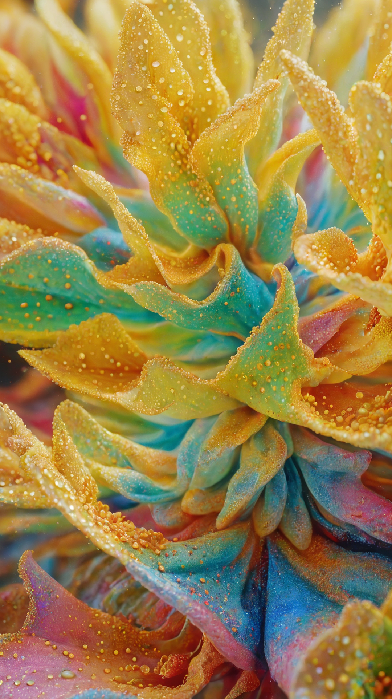
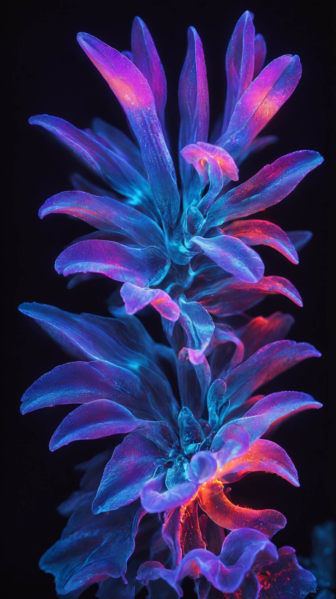

# Ras-DiffVG (Robotic Painting Fork)

This is a customized fork of [DiffVG](https://github.com/BachiLi/diffvg), originally developed by Li et al. (SIGGRAPH 2020).  

DiffVG is a differentiable rasterizer for 2D vector graphics: it represents an image as parametric strokes (polylines/Béziers) and optimizes their positions, widths, and colors so the render matches a target bitmap. This fork adapts DiffVG’s painterly rendering scripts for a physical brush painting robot.

For original DiffVG documentation, see [upstream README](https://github.com/BachiLi/diffvg).


## workflow
1) **input image → DiffVG render**  
   Run `painterly_rendering_opaque.py` to optimize strokes and save `results/<run>/<name>_diffvg.json` (+ PNG/SVG previews).

2) **post-process for robot**  
   Convert `*_diffvg.json` → `<name>_kuka.json` (crop to canvas, normalize coords, assign brush 0/1, sort by brush→hue→value).  
   _(Link to yr post-processing script/repo here.)_

3) **execute**  
   Load `<name>_kuka.json` in the robot control to paint the diffvg interpretation of the painting.


# flags
| flag            | example            | description                                                                                              |
| --------------- | ------------------ | -------------------------------------------------------------------------------------------------------- |
| `--num_paths N` | `--num_paths 1500` | Number of strokes initialized. Higher = more detail, but slower optimization.                            |
| `--num_iter N`  | `--num_iter 300`   | Number of optimization iterations. Use **300** for stable convergence; fewer leaves strokes unoptimized. |
| `--max_width W`     | `--max_width 7.4`                     | Maximum stroke thickness (maps to physical brush size). **Defaults used in practice:**<br>• 1080×1920 image → 7.0 (large brush), 4.0 (detail brush)<br>• 1024×1024 image → 4.0 (large), 2.0 (detail). |
| `--ignore_alpha`    | `--ignore_alpha`                      | Treat input as fully opaque; ensures strokes don’t rely on transparency layers.                                                                                                                       |
| `--bg_color "#hex"` | `--bg_color "#120e0e"`                | Sets background canvas color. Helps optimizer fill evenly, especially with non-white backgrounds.                                                                                                     |
| `--fill_whitespace` | `--fill_whitespace`                   | After optimization, add strokes to cover any uncovered regions (“whitespace”).                                                                                                                        |
| `--init_json PATH`  | `--init_json results/..._diffvg.json` | Load a previous JSON and **freeze those strokes**. Enables layered workflows.                                                                                                                         |
| `--extra_paths N`   | `--extra_paths 200`                   | Add new strokes on top of a frozen `init_json` layer (e.g. for detail passes).                                                                                                                        |
| `--init_on_color`   | `--init_on_color`                     | Bias initial stroke placement toward colorful regions; avoids wasting strokes in empty/black areas.                                                                                                   |
| `--black_thresh T`  | `--black_thresh 0.2`                  | Treat pixels below threshold brightness as “black” and avoid initializing strokes there. Useful for black canvas workflows.                                                                           |


# example: details

<p align="center">
  
| input | large brush | detail brush |
|-------|-------------|--------------|
|  |  |  |

</p>

### Pass 1: large brush strokes
```bash
python painterly_rendering_opaque.py imgs/rainbow_flower_closeup.png \
  --num_paths 1500 \
  --max_width 7.4 \
  --ignore_alpha \
  --bg_color "#120e0e" \
  --num_iter 300 \
  --fill_whitespace
  ```

### pass 2: details brush strokes 
```bash
python painterly_rendering_opaque.py imgs/rainbow_flower_closeup.png \
  --init_json results/20250828_164741-rainbow_flower_closeup_big_brush/rainbow_flower_closeup_diffvg.json \
  --extra_paths 200 \
  --max_width 4.0 \
  --num_iter 300 \
  --ignore_alpha
  ```

# example: black canvas

<p align="center">
  
| input | large brush |
|-------|-------------|
|  |  
</p>

### Pass 1: large brush strokes
```bash
python painterly_rendering_opaque.py imgs/pink_and_blue_lone_flower_blackbg.png \
  --num_paths 500 \
  --num_iter 300 \
  --max_width 7.4 \
  --ignore_alpha \
  --bg_color "#120e0e" \
  --init_on_color \
  --black_thresh 0.2 
  ```


little description here: esepecially helpful for painting on a black canvas where you do not want the entire canvas covered. allows you set a black threhsold where you do not want strokes initialzied. result is just creatign colored stroeks. black_thresh can be increased to aboid init on darker colors. black_thresh set to 0.0 is true black 


#notes
- max_width is important and depends on the size of the input image and the size of the physical paitn brush the system is using. for our use case with an image that is 1080 x 1920 we are usign max_width 7.0 for large physical brush and max_width 4.0 for the second pass where we intialize detail strokes using a smaller phsycial brush 

- for image size of 1024 x 1024 we use max_width 4.0 for large brush and max_width 2.0 for detail strokes using the smaller physical brush 

--num_paths is how many strokes are intialized 
--max_width is the maximum thickness that the strokes optimize towards
-- ignore_alpha is required to make sure that the strokes are opaque
-- bg_color allows you to set the background color of the image. this helps reduce the amount of empty space on the cavnas and helps force the optimzier to cover the background color espeicallt if the backgroudn color is a disntict color not already part of the image color 
--num_iterations should be 300. anythign lower resutls in unoptimized strokes. even if not visible in the renderign the unoptimzied strokes are a part of the json and severelt impact the visual accuracy match of the phuysical robot painting
--fill_whitespace runs after the set num_iterations and adds new strokes on any parts of the canvas where whitespace is still aparent. this helps us cover the canvas in its entirety 
--init_json allows you to upload a prexisitign json file and freezes it. no stokees in init_json are changed but htis can be used to create and cotnrol layered paitnings. allows you to freeze a layer of the painitng 
-- extra_paths is used with init_json to add new strokes on top of the frozen layer. this is what we have been using for detail layers. f